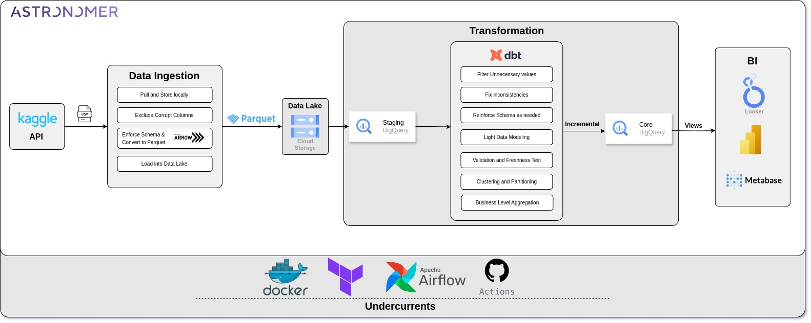

# Transfermarkt Data Pipeline
This is an end-to-end, production-tested ELT batch data pipeline using a modern data stack, designed in optimized way to streamline data processing and analysis of club football and the transfer market.

## Table of Contents
  - [Objectives](#objectives)
  - [Running the Pipeline](#running-the-pipeline)
  - [Pipeline Architecture](#pipeline-architecture)
  - [Data Stack](#data-stack)
  - [Workflow Description](#workflow-description)
    - [Infrastructure Setup](#infrastructure-setup)
    - [Extract](#extract)
    - [Pre-Process](#pre-process)
    - [Load](#load)
    - [Transform](#transform)
    - [CI/CD Pipeline](#cicd-pipeline)
    - [Alerting, Logging, and Monitoring](#alerting-logging-and-monitoring)
  - [Data Visualization](#data-visualization)
  - [Improvements](#improvements)

## Objectives

This project aims to enable sports analysts to derive key insights about the football clubs, matches,players and the transfer market. A dashboard has been created about football club's seasonal stats using the final dataset to showcases the application. The dashboard also provides an option to compare multiple football clubs using the same matrices.

## Running the Pipeline

For detailed instructions on how to run the pipeline, please refer to the following markdown files:

- [Running Locally](./docs/running_locally.md)
- [Running in Production](./docs/running_in_astro.md)

## Pipeline Architecture

  

The architecture of this project is designed to efficiently handle data extraction, processing, and transformation while ensuring scalability and reliability. The core components are integrated to streamline the data flow from raw sources to final analytical outputs, following industry best practices and leveraging modern data engineering tools.

## Data Stack

- **Orchestration:** Astronomer managed Apache Airflow
- **Data Lake:** Google Cloud Storage
- **Data Warehouse:** Google BigQuery
- **Data Transformation:** DBT
- **Infrastructure as Code:** Terraform
- **Containerization:** Docker
- **Others:** Pyarrow and Pandas

## Workflow Description
Airflow directed acyclic graph

  

### Infrastructure Setup

Terraform is used to manage the creation and destruction of resources. The main resources are Astronomer workspace, cluster, deployment for production setup and general cloud resources like Cloud Storage Bucket and BigQuery datasets. Refer to the [infrastructure directory](./infrastructure) for details.

### Extract

Raw data is pulled from Kaggle via API and stored locally using a reusable Python module. For larger datasets, direct streaming to Google Cloud Storage (GCS) is more suitable, though it comes with trade-offs like increased latency and complexity but has benifits such as availability, durability and almost infinite storage.

**Security Note:** The only method to authenticate with Kaggle api without having a physical json file is through environment variables as it isn't meant for using in such data pipelines.

### Pre-Process

A corrupt file with inconsistent columns are handled. Pyarrow's auto schema detection is used to enforce a primary schema and then files are serialized to Parquet format for compression and schema retention. The whole process in done using in parallel using multithreading.

### Load

Parquet files are loaded into Google Cloud Storage and then into Google BigQuery as staging (Silver) data.

### Transform

Using DBT, data from the staging dataset is transformed into Gold level data. This process includes adding new values through extraction, filtering unnecessary values, fixing inconsistencies, reinforcing schemas if required, and some data modeling.

**Best practices and optimizations:**

1. **Validating and Freshness Tests:** Ensuring data accuracy and timeliness through validation and freshness checks.
2. **Incremental Materialization:** Processing only new data to improve efficiency and reduce computational costs.
3. **Partitioning and Clustering:** Organizing data based on hypothetical needs to speed up query performance and retrieval times.
4. **Business-Level Aggregation:** Summarizing data to provide actionable insights for reporting and analysis.

**Issue:** Initially, materialized views were used for reporting tables to enhance data retrieval by pre-computing and storing data at refresh intervals. However, due to limitations with BigQuery's materialized views, regular views are now used, which only store the query logic.

### CI/CD Pipeline

For production setup, CI/CD is enforced using GitHub Actions to Astro deployment. Refer to the [Running the Pipeline in Production](./production_pipeline.md) section for more details.

### Alerting, Logging, and Monitoring

This section hasn't been configured yet but I have a plan to make a logging data pipeline using the ELK stack in the near future.

## Data Visualization

The interactive dashboard below provides a comprehensive seasonal analysis of various football clubs, offering valuable insights into their performance and trends throughout the season.

[Due to security concerns I can't provide access to the interactive dashboard. The dashboard isn't totally static, on paremeter changes or after certain interval it queries data from BigQuery which isn't entirely free.]

## Improvements

1. Add more validation and freshness tests for DBT models.
2. Add tests for the DAGs.
3. Make a dashboard that groups all club data under one plane for better comparative insights.
4. Implement the logging pipeline
